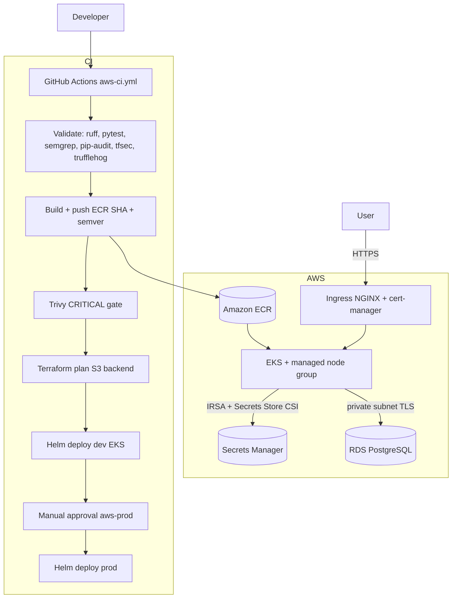

# Healthcare App — AWS (EKS + private RDS)

Standalone deployment slice parallel to Azure AKS. The FastAPI application is built from the
**repository root** (`main.py`, `Dockerfile`, `requirements.txt`):

```bash
docker build -f Dockerfile -t healthcare-app:local .
```

Azure remains at repo root (`terraform/azure/`, `charts/healthcare-app/`, `azure-pipelines.yml`).

---

## Architecture



---

## Deploy commands (in order)

### 0. Prerequisites

- AWS CLI, Terraform `>= 1.4`, kubectl, Helm 3, Docker
- IAM permissions for VPC, EKS, RDS, ECR, Secrets Manager

### 1. Bootstrap Terraform remote state (one-time)

```bash
export AWS_REGION="us-east-1"
export AWS_ACCOUNT_ID="$(aws sts get-caller-identity --query Account --output text)"
export TF_STATE_BUCKET="healthcare-tfstate-${AWS_ACCOUNT_ID}"

aws s3api create-bucket --bucket "$TF_STATE_BUCKET" --region "$AWS_REGION"
aws s3api put-bucket-versioning --bucket "$TF_STATE_BUCKET" \
  --versioning-configuration Status=Enabled
aws dynamodb create-table \
  --table-name healthcare-tfstate-lock \
  --attribute-definitions AttributeName=LockID,AttributeType=S \
  --key-schema AttributeName=LockID,KeyType=HASH \
  --billing-mode PAY_PER_REQUEST
```

### 2. GitHub OIDC for AWS (one-time)

Create an IAM OIDC identity provider for `token.actions.githubusercontent.com` and IAM roles
for `AWS_TERRAFORM_ROLE_ARN` and `AWS_DEPLOY_ROLE_ARN` with least-privilege policies.
Set repository variables listed in `aws/.github/workflows/aws-ci.yml`.

### 3. Terraform

```bash
cd aws/terraform
terraform init \
  -backend-config="bucket=healthcare-tfstate-${AWS_ACCOUNT_ID}" \
  -backend-config="key=healthcare/aws/dev/terraform.tfstate" \
  -backend-config="region=${AWS_REGION}" \
  -backend-config="dynamodb_table=healthcare-tfstate-lock"
terraform plan -var-file=environments/dev.tfvars
# terraform apply  # plan-only in CI unless you own the account
```

### 4. EKS add-ons

See `aws/k8s/README.md` (cert-manager, ingress-nginx, Secrets Store CSI driver).

### 5. Build, push, Helm deploy

```bash
aws ecr get-login-password --region us-east-1 | docker login --username AWS --password-stdin ACCOUNT.dkr.ecr.us-east-1.amazonaws.com
docker build -f ../../Dockerfile -t healthcare-app:SHA ../..
docker tag healthcare-app:SHA ACCOUNT.dkr.ecr.us-east-1.amazonaws.com/healthcare-app:SHA
docker push ACCOUNT.dkr.ecr.us-east-1.amazonaws.com/healthcare-app:SHA

aws eks update-kubeconfig --name healthcare-eks-dev --region us-east-1
helm upgrade --install healthcare-app aws/charts/healthcare-app \
  --namespace healthcare-dev --create-namespace \
  --set image.repository=ACCOUNT.dkr.ecr.us-east-1.amazonaws.com/healthcare-app \
  --set image.tag=SHA \
  --set serviceAccount.annotations."eks\.amazonaws\.com/role-arn"=arn:aws:iam::ACCOUNT:role/healthcare-eks-dev-app-irsa
```

---

## Design decisions

- **EKS + Helm** mirrors the Azure AKS path for apples-to-apples comparison in the take-home.
- **IRSA** replaces static AWS keys for pods and CI (`aws-actions/configure-aws-credentials`).
- **Secrets Manager CSI** syncs `DATABASE_URL` into `db-credentials` (same pattern as Azure KV CSI).
- **HPA at 70% CPU** and **NetworkPolicy** egress to DB + DNS match the root Helm chart conventions.

---

## Limitations

- Terraform **apply** is not run in CI by default (cost control).
- EKS node group uses default cluster security groups; tighten with custom node SGs in production.
- cert-manager / ingress-nginx / CSI driver installs are documented, not in Terraform.
- Chart adapted from root `charts/healthcare-app/` (Azure provider → AWS provider).

---

## Layout

```
aws/
  README.md
  terraform/              modules + environments/
  charts/healthcare-app/  EKS Helm (IRSA + AWS CSI)
  k8s/                    cert-manager ClusterIssuer
  .github/workflows/      aws-ci.yml (canonical; mirrored at repo `.github/workflows/aws-ci.yml` for GitHub discovery)
  scripts/                ai_pr_review.py
  docs/HITRUST-AWS.md
```
