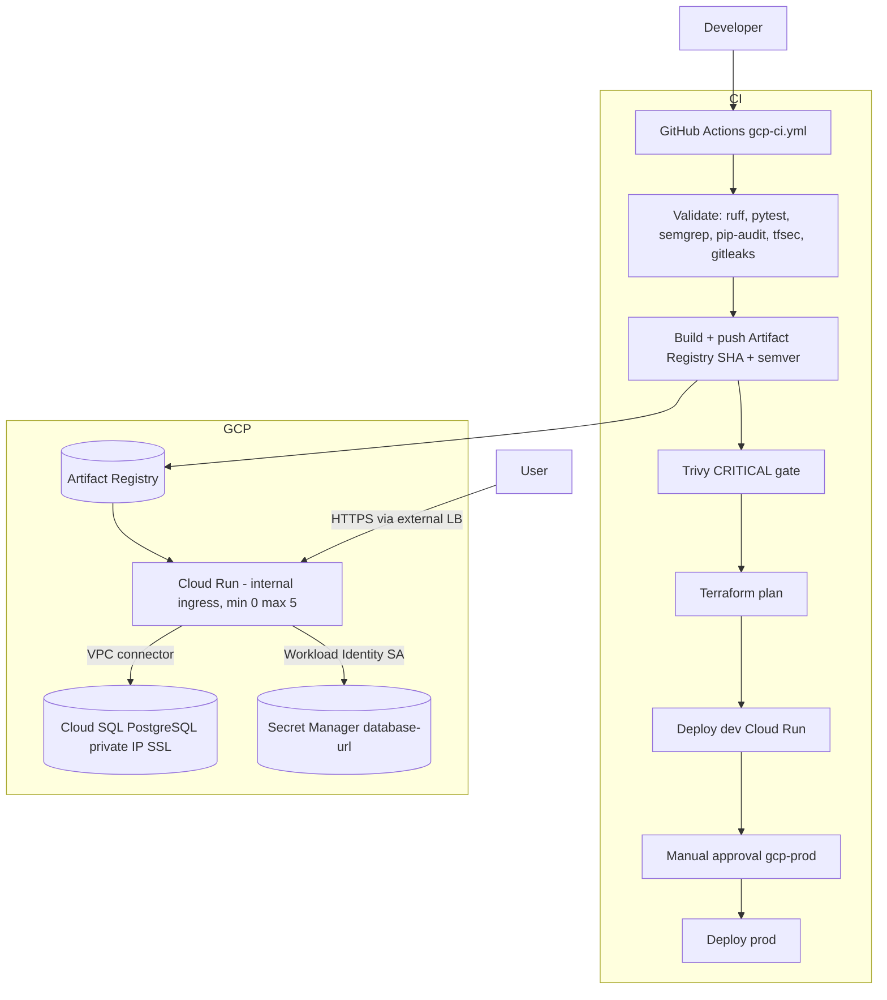

# Healthcare App — GCP (Cloud Run + private Cloud SQL)

Standalone deployment slice for the Sr. DevOps assessment **Option A** (Cloud Run). The FastAPI app
lives at the **repository root** (`main.py`, `Dockerfile`, `requirements.txt`); build with:

```bash
docker build -f Dockerfile -t healthcare-app:local .
```

Azure assets remain at repo root (`terraform/azure/`, `charts/`, `azure-pipelines.yml`) and are untouched.

---

## Architecture



---

## Deploy commands (in order)

### 0. Prerequisites

- `gcloud`, Terraform `>= 1.4`, Docker
- GCP project with APIs: Compute, Cloud SQL Admin, Secret Manager, Artifact Registry, Cloud Run, VPC Access, Service Networking

### 1. Bootstrap remote state (one-time)

```bash
export PROJECT_ID="your-gcp-project-id"
export REGION="us-central1"
gcloud config set project "$PROJECT_ID"
gsutil mb -p "$PROJECT_ID" -l "$REGION" -b on "gs://healthcare-tfstate-${PROJECT_ID}"
gsutil versioning set on "gs://healthcare-tfstate-${PROJECT_ID}"
```

### 2. Workload Identity Federation for GitHub (one-time)

Create a WIF pool/provider and SA with roles: `roles/artifactregistry.writer`, `roles/run.developer`,
`roles/secretmanager.admin` (narrow in production), `roles/storage.objectAdmin` on the tfstate bucket.
Set GitHub repository variables: `GCP_WIF_PROVIDER`, `GCP_WIF_SA_EMAIL`, `GCP_PROJECT_ID`,
`GCP_AR_REPO`, `GCP_TFSTATE_BUCKET`.

### 3. Terraform

```bash
cd gcp/terraform
terraform init \
  -backend-config="bucket=healthcare-tfstate-${PROJECT_ID}" \
  -backend-config="prefix=healthcare/gcp/dev"
terraform plan -var-file=environments/dev.tfvars -var="project_id=${PROJECT_ID}"
# terraform apply  # assessment: plan-only in CI unless you own the project
```

DB password is generated by `random_password` and stored only in Secret Manager + encrypted state.

### 4. Build and push image

```bash
docker build -f ../../Dockerfile -t healthcare-app:$(git -C ../.. rev-parse HEAD) ../..
gcloud auth configure-docker ${REGION}-docker.pkg.dev
docker tag healthcare-app:SHA ${REGION}-docker.pkg.dev/${PROJECT_ID}/healthcare/healthcare-app:SHA
docker push ${REGION}-docker.pkg.dev/${PROJECT_ID}/healthcare/healthcare-app:SHA
```

Update `cloud_run_image` in tfvars or use `gcloud run services update` after first apply.

### 5. Custom domain + HTTPS (manual / LB)

Cloud Run uses `INGRESS_TRAFFIC_INTERNAL_ONLY` in Terraform. For public HTTPS:

1. Create a **serverless NEG** pointing at the Cloud Run service.
2. Attach to an **external HTTPS load balancer** with a Google-managed certificate.
3. Set Cloud Run ingress to `internal-and-cloud-load-balancing`.
4. Point DNS at the LB IP.

Not fully automated here to avoid org-specific DNS/cert ownership.

---

## Design decisions

- **Cloud Run + VPC connector** instead of GKE: matches assessment Option A with fewer moving parts while keeping private DB access.
- **No JSON keys**: runtime and CI use GCP service accounts + WIF.
- **Secret Manager** for `DATABASE_URL`; password never in git or tfvars.
- **Reusable modules** under `gcp/terraform/modules/` with `environments/{dev,prod}.tfvars`.

---

## Limitations

- CI **terraform apply** is plan-oriented by default (cost control); wire `apply` behind a manual gate when ready.
- Custom domain/LB steps are documented, not fully in Terraform.
- Legacy root `terraform/modules/{network,database,compute}` are superseded by `gcp/terraform/modules/`.

---

## Layout

```
gcp/
  README.md
  terraform/           root module + modules + environments/
  deploy/cloudrun/     supplemental deploy notes
  .github/workflows/   gcp-ci.yml (canonical; mirrored at repo `.github/workflows/gcp-ci.yml` for GitHub discovery)
  scripts/             ai_pr_review.py (copy of root script)
  docs/HITRUST-GCP.md
```
